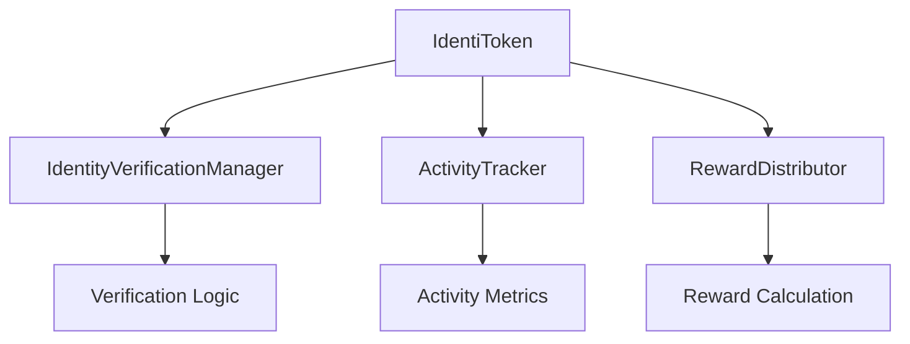
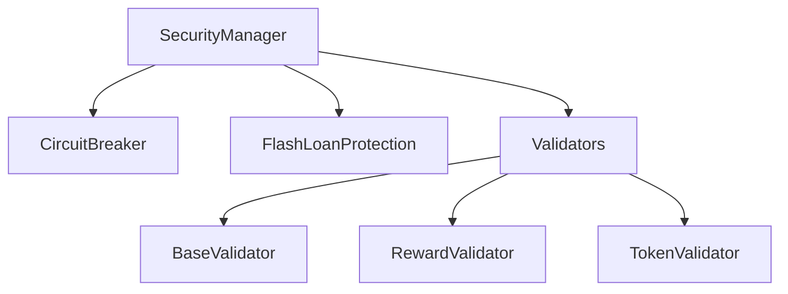
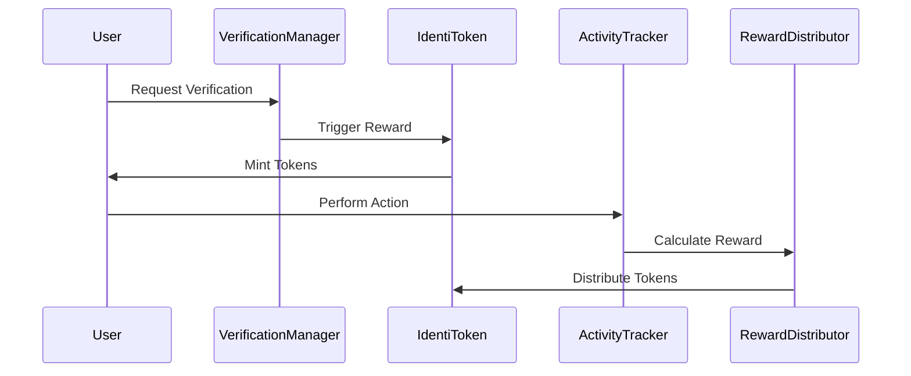

# Technical Architecture

## Smart Contract Architecture

### Core Contracts



### Security Layer



### Data Flow



## Frontend Architecture

### Component Structure

```
src/
├── components/
│   ├── ecosystem/
│   │   ├── TokenStats.jsx
│   │   ├── VerificationStatus.jsx
│   │   ├── ActivityMetrics.jsx
│   │   └── RewardPanel.jsx
│   └── ui/
│       └── Card.jsx
├── hooks/
│   ├── useContractRead.ts
│   └── useContractWrite.ts
├── pages/
│   ├── Dashboard.jsx
│   ├── Verify.jsx
│   └── Rewards.jsx
└── config/
    └── contracts.ts
```

### State Management

- Wagmi for blockchain state
- React Query for data fetching
- React Context for global state
- Local state for component-specific data

### Data Flow

1. Contract Interaction
   - Hooks abstract contract calls
   - TypeScript ensures type safety
   - Error handling middleware

2. User Interface
   - Component composition
   - Responsive design
   - Progressive enhancement

3. Security
   - Input validation
   - Transaction confirmation
   - Error boundaries